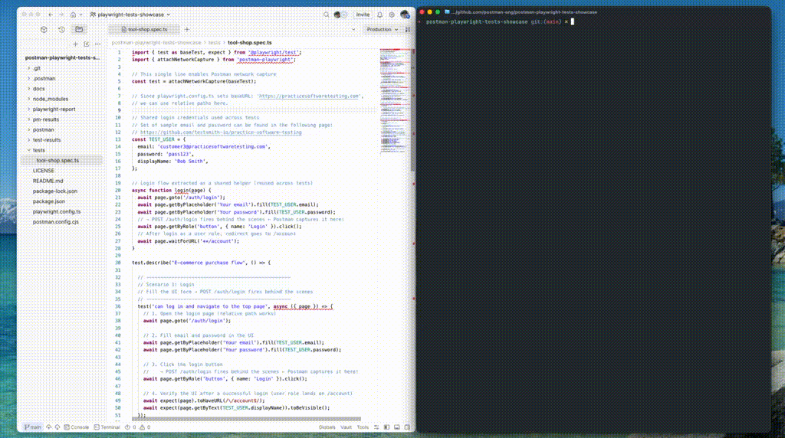

# postman-playwright-tests-showcase

This repository is a sample project showcasing the Postman x Playwright integration. It demonstrates how to use Postman's new [postman-playwright](https://www.npmjs.com/package/postman-playwright) plugin to capture API requests from Playwright test code and run tests from the related Postman collection.

## Contents

- [ Sample Application: Tool Shop](docs/sample-app.md)
- [Setup Guide](docs/setup.md)
- [Playwright x Postman連携入門(Japanese Article)](https://qiita.com/yokawasa/items/b6998ed067e4b2b43559)
